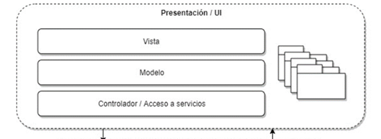
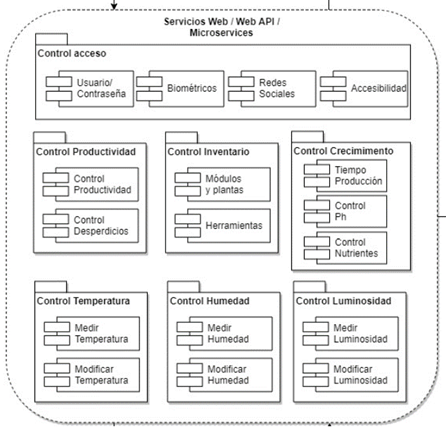
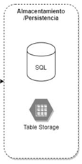
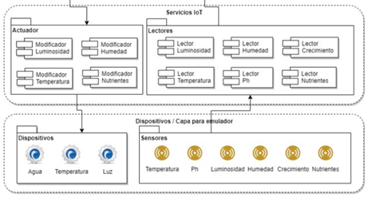

# DESCRIPCION ARQUITECTURA

Esta aplicación será desarrollada en Visual Studio .Net y trabajará en la plataforma Azure.

La arquitectura de la aplicación estará dividida en cuatro partes, la parte Front será un proyecto MVC 

Para el Back se tendrá un proyecto Web Api el cual dispondrá los servicios y a su vez servirá de capa de conexión entre las partes de persistencia, IoT y la presentación.

Se contara con una capa que manejara la persistencia y que interactúa con la parte de Web Api.

Se contará con una capa que manejara la persistencia y que interactúa con la parte de Web Api.

