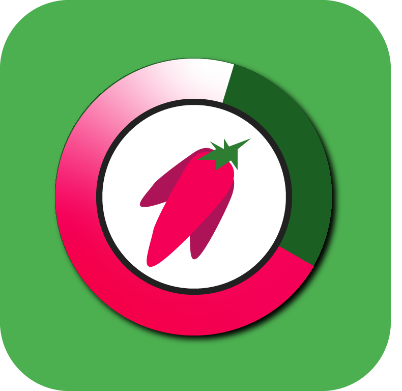

# FutureAgro

Aplicación para control de cultivos hidrofónicos.

## Integrantes del Equipo

- [Raul Fernando Dominguez Marin](rfdomingum@eafit.edu.co)
- [Jairo Alberto Soto Velásquez](jasotov@eafit.edu.co)
- [David Fernando Palacio Colorado](dspalacioc@eafit.edu.co)
- [Alexandra Troyano Perenguez](atroyanop@eafit.edu.co)
- [Fabio Andres Tangarife Alvarez](fatangaria@eafit.edu.co)

# Información general del proyecto

## Lenguajes de software utilizados en la elaboración de los componentes

Para el desarrollo de los componentes de backend de la aplicación se utilizaron los siguientes framweroks.

- C#
- SQL
- JavaScript
- CSS

## Componentes desarrollados por terceros. 

### jQuery JavaScript Library v3.3.1

Biblioteca de JavaScript rápida, pequeña y rica en funciones. Hace que cosas como el desplazamiento y la manipulación de documentos HTML, el manejo de eventos, la animación y Ajax sean mucho más simples con una API fácil de usar que funciona en una multitud de navegadores.

### Microsoft.AspNetCore.Identity.EntityFrameworkCore 2.1.6

Proveedor de ASP.NET Core Identity que usa Entity Framework Core.

### ASP.NET Core SignalR

Componente para la actualización en tiempo real, para habilitar la capacidad de hacer que su código del lado del servidor envíe contenido a los clientes conectados como sucede, en tiempo real.

### Lamar 3.2.0

Herramienta IoC compatible con ASP.Net Core rápida, sucesora de StructureMap

### Microsoft.AspNetCore.Razor.Design 2.2.0

Razor Pages puede hacer que la codificación de escenarios centrados en páginas sea más fácil y más productiva que el uso de controladores y vistas.

## Frameworks base

### Asp .Net Core MVC

Framework de código abierto multiplataforma de alto rendimiento para crear aplicaciones modernas, basadas en la nube y conectadas a Internet

## Enlace repositorio

[FeatureAgro en GitHub](https://github.com/jsoto0025/FeatureAgro)

